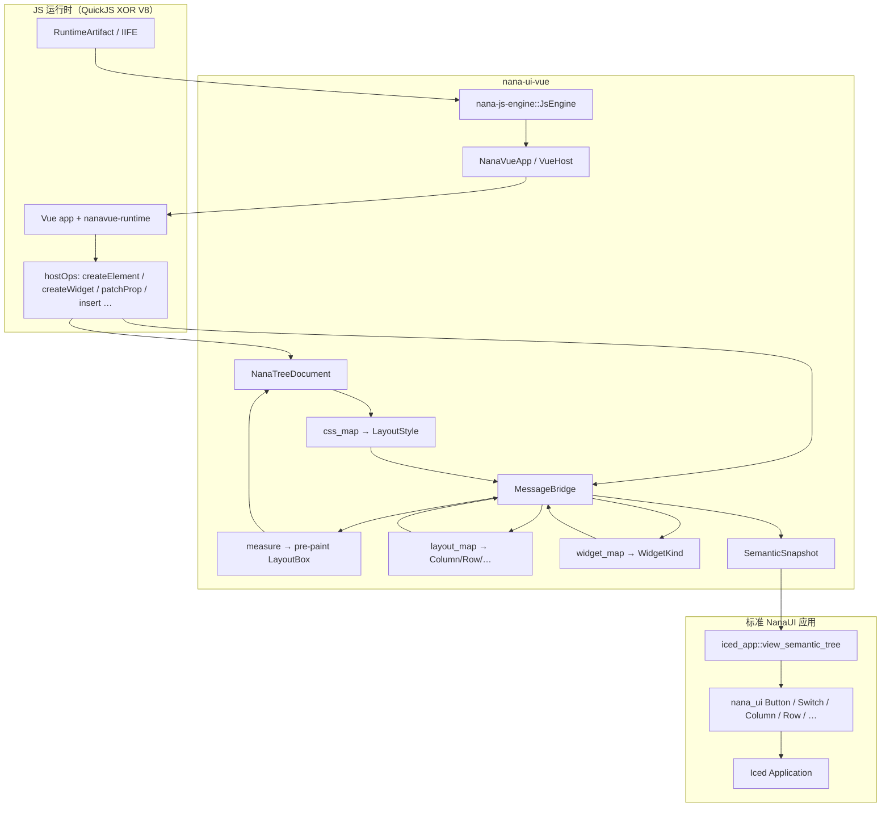
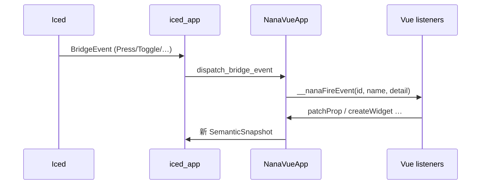

# Vue → NanaUI 渲染系统

> 系统化加载路径：Vue Custom Renderer → 语义/布局树 → 标准 NanaUI 应用 → Iced 绘制。  
> 无 WebView、无 Blitz、无 CustomContent。JS 引擎经 `nana-js-engine` 互斥选一（QuickJS XOR V8）。

## 0. 三层兼容模型（设计合同）

Issue #5 及后续桥接工作的目标合同是 **三层兼容**：同一产品可按层选用入口，并允许混合显示。  
三层最终都落到 **Nana Style Model**，再由 **NanaUI（Iced）唯一绘制**；CSS / Vue / Tauri 只住在实验/桥接层，**不**进入 `nana-ui` 公共核心依赖。

### Style Model（共享合同）

```text
L1 CSS 子集 ──► Nana Style Model（Tokens + Semantics + Layout）
L2 Vue props ─► 同一套 Model
L3 Rust API ──► 同一套 Model
                 ▼
           唯一绘制：nana-ui widgets
```

| 切片 | 含义 | 典型映射 | 住在哪 |
|------|------|----------|--------|
| **Tokens** | 主题色 / 间距 / 圆角档位 | `ThemeMetrics`、`SemanticPalette`；Iced 侧 `Colors`/`ThemeTokens` 为适配 | `nana-ui-core`（`ThemeMetrics`、`SemanticColor`/`SemanticPalette`）+ `nana-ui::theme`（Iced） |
| **Semantics** | 控件种类与意图 | 已知 class（如 `nana-btn--primary`）→ `WidgetKind` + `ButtonKind` / `ControlSize` | `nana-ui-core::semantics`；L1/L2 经 `widget_map` / props |
| **Layout** | flex / gap / padding / 尺寸 | CSS 子集或布局 tag → `LayoutStyle` / `LengthSpec` / `ParentBox` | **纯数据** `nana-ui-core::box_layout`；L1 **parse** 在 `nana-ui-vue::css_map`（**非** CSSOM） |

**纠正**：L1 不是「CSS 全部直接变成 `ThemeTokens`」。任意业务 CSS 色值不得污染正式 token。  
L1 色值：已知 token/class → `SemanticColorRole`；未知 `#hex` 只可留作受限 paint hint，**不**写入正式 ThemeTokens（见 `map_css_color_for_tokens`）。
任意业务色不得据此发明 ThemeTokens 或开辟第二条 paint 路径——唯一绘制仍是 L3 NanaUI widgets。

权威模块索引：[`nana_ui_core::style_model`](../crates/nana-ui-core/src/style_model.rs)、[`nana_ui_core::box_layout`](../crates/nana-ui-core/src/box_layout.rs)。

| 层 | 意图 | 入口 | 样式路径 | 拥有方 | 对齐现状 |
|----|------|------|----------|--------|----------|
| **L1 完整 Tauri Vue** | 尽量靠近原 Tauri 业务与布局表现：加载外部 Vue/IIFE + Tauri 兼容 invoke | `nana-tauri-demo --project …`；`nanavue-runtime` `createElement` / `patchProp`；`tauri_compat` | HTML/class/inline → Style Model（Layout + Semantics + 可选 Tokens）；**兼容子集**，非完整 CSSOM | 桥接：`nana-ui-vue`、`nana-ui-web-api`、`nana-tauri-demo`、`packages/nanavue-runtime` | **home/settings 子集宣称闭合**（css-parity 绿；见 [`css-layout-parity.md`](css-layout-parity.md)）；阶段 Todo 与 X1–X7 审计见 [`compatibility-roadmap.md`](compatibility-roadmap.md)（**X4/X5/X6/X7 已兑现**含事件矩阵 D-04；X1 等仍 open）；完整 cascade / 像素级保真为**非目标**；`fixed` 视口子集已兑现；`sticky`/完整 2D grid **defer** |
| **L2 Nana 组件 × Vue** | Vue 直接调 Nana 组件接口；用 Vue props / 语义标签配置，**可跳过 CSS 解析与转换** | `@nanaui/nanavue-components`（`NanaButton` 等）→ `nana-*` / `createWidget` | 语义 props → Style Model Semantics（+ Tokens）；可选 class 仅作 hint | `packages/nanavue-components` + `nana-ui-vue`（`widget_map` / MessageBridge） | **已有**（MVP 控件子集） |
| **L3 Rust NanaUI** | 直接用 Rust 写布局与控件；Style Model 原生入口与**唯一绘制** | `nana-ui` API：`DesktopShell` / `WorkspaceController` / widgets；`component-gallery` | builder / `ThemeTokens` / `AppearanceSettings` → 同一 Model | `crates/nana-ui`、`nana-ui-core`（公共边界） | **已有**（产品默认路径） |

### 混合显示（合同）

- **L1 + L2（优先支持）**：同一棵 Vue 树内可并存。`createElement`（降维）与 `createWidget` / `nana-*` 都写入同一 `MessageBridge` 森林；显式语义 props 优先于 class 默认，再覆盖 inline style。历史文档中的「C 混合」即本合同的 L1+L2。
- **L3 + L1/L2**：宿主用 Rust 组装壳 / Region，把 `view_semantic_tree*`（Vue 语义快照）嵌进某一 Region 或主列。`nana-tauri-demo` windowed：直播径为 L3 `DesktopShell`（owned workspace 快照满足 Hosted `'static`）+ Primary 语义树 + Navigation / Inspector 桥接摘要；不旁路 L3 绘制。
- **三层同屏**：合法；绘制唯一路径仍是 Iced。禁止为混合另起 WebView / CustomContent / 第二套 Device。

### 「完整 CSS 渲染」边界（L1 澄清）

L1 的「完整 CSS」表示 **兼容目标**：尽可能靠近原 Tauri 布局与业务表现。  
实现上是把 CSS **映射到 Nana Style Model**（Tokens 档位 + Semantics + Layout），而不是把 CSSOM 变成 `nana-ui` 的公共事实源，也不是「全部 CSS → `ThemeTokens`」，更不是恢复 Blitz/stylo 全量引擎。子集能力与缺口见本文 §5 与 [`css-layout-parity.md`](css-layout-parity.md)。

### 与 Issue #5 验收的关系

Issue #5 MVP 已签字的是 **引擎桥、Custom Renderer、nanavue 组件、宿主加载、权限** 等落地项；**并未**把「三层兼容」写成验收表条款。  
本节省是 **目标合同**：L2/L3 与同树 L1+L2 混合已基本具备；L1 保真与更深的壳级混合属于后续加深，不推翻 MVP 签字。详见 [`performance/2026-08-06-issue5-final-acceptance.md`](performance/2026-08-06-issue5-final-acceptance.md) §「三层兼容合同」。

## 1. 目标关系

| 层 | 职责 | 不做什么 |
|----|------|----------|
| Vue / JS | 业务状态、组件组合、事件 | 不直接 paint、不持有窗口 |
| Custom Renderer (`nanavue-runtime`) | `hostOps` → `__nanaHost.call` | 不实现 CSS 引擎 |
| `nana-ui-vue` | 树文档 + MessageBridge + CSS 子集映射 | 不引入第二套 Device/Queue |
| NanaUI (`nana-ui`) | Workspace / Shell / 控件合同 | 不内嵌业务 IIFE；不依赖 CSS/JS |
| Iced | 唯一绘制路径 | — |
| 宿主 (`nana-tauri-demo`) | 窗口、引擎选型、权限、加载外部 bundle | 不替代映射层 |

自定义组件 = 基础元素的**变体/组合**，最终结果仍是标准 Nana 控件树。

## 2. 数据流



事件回传：



## 3. 模块清单（`crates/nana-ui-vue`）

| 模块 | 职责 | Style Model |
|------|------|-------------|
| `app` | 公开入口：`NanaVueApp`、`mount_vue_as_nana` | L1/L2 宿主 |
| `renderer` | DOM/语义 hostOps（`createElement` / `createWidget` / `patchProp` …） | L1+L2 同桥 |
| `tree` | `NanaTreeDocument`：DOM 兼容节点森林 + measured/iced 布局盒缓存 + hit-test | 几何缓存，不实现布局 |
| `bridge` | `MessageBridge` / `SemanticSnapshot` / `BridgeEvent` / `WidgetProps` | Model 载体 |
| `widget_map` | tag / class / role / type → `WidgetKind` | → **Semantics** |
| `layout_map` | 布局类标签与方向默认；与 `LayoutStyle` 协同 | → **Layout** |
| `css_map` | CSS 子集 **parse** → `LayoutStyle`（类型在 core；**不是** ThemeTokens 工厂） | → **Layout** |
| `style` | L1 paint 色值解析；任意色不进入正式 token | 受限 paint hint |
| `iced_app` | `SemanticSnapshot` → 真实 `nana_ui` Iced 元素（feature `iced-view`）；子文件 `layout_convert` / `l1_charts` / `overlay` / … | → L3 绘制 |
| `svg_icon` | L1 SVG/图表几何 → iced `svg`（优选 heatmap 轨；非 Semantics） | L1 paint 例外 |
| `capabilities` | Permission / workspace host API（与绘制解耦） | — |

JS 侧：

| 包 | 层 | 职责 |
|----|----|------|
| `@nanaui/nanavue-runtime` | L1+L2 | `createRenderer(hostOps)`、`createWidget`、事件桥 |
| `@nanaui/nanavue-components` | L2 | Nana* 语义组件（跳过 CSS；变体，非旁路 paint） |
| `nana-ui-web-api` / `nana-tauri-demo` | L1 | Web API 兼容 + Tauri 项目加载（非 WebView paint） |

## 4. 元素映射表

### 4.1 布局 → Nana

| Vue / HTML / class | `WidgetKind` | Nana / Iced |
|--------------------|--------------|-------------|
| `nana-column` / `div` / `section` / `main` / … | `Column` | `iced::column` + padding/gap |
| `nana-row` / `flex-row` / `hstack` / `flex-direction:row` | `Row` | `iced::row` + padding/gap |
| `nana-box` / `container` | `Box` | 同 Column（诊断用） |
| `nana-card` / `.card` | `Card` | `nana_ui::Card` |
| `nana-sidebar-frame` | `SidebarFrame` | 列布局壳（内容区组合） |
| `nana-settings-card` | `SettingsCard` | 列布局壳 |

### 4.2 基础控件 → Nana

| Vue / HTML / class | `WidgetKind` | Nana API |
|--------------------|--------------|----------|
| `nana-button` / `button` / `role=button` | `Button` | `nana_ui::Button` + `ButtonKind` |
| `nana-chip` | `Chip` | `Button` Selected/Subtle |
| `nana-text` / `span` / `p` / `h1`… | `Text` | `iced::text` |
| `nana-input` / `input` | `Input` | `nana_ui::Input` |
| `nana-textarea` | `Textarea` | `Input` |
| `nana-checkbox` / `input[type=checkbox]` | `Checkbox` | `nana_ui::Checkbox` |
| `nana-switch` / `role=switch` | `Switch` | `nana_ui::Switch` |
| `nana-select` / `select` / `dd` / `role=listbox` | `Select` | `nana_ui::Select`（pick-list；Lilia Dropdown 别名） |
| `nana-dialog` / `role=dialog` / `ui-dialog` / `modal` | `Dialog` | `nana_ui::Dialog`（`open`/`active`；`aria-modal` presence） |
| `nana-popover` | `Popover` | `nana_ui::Popover` |
| `nana-context-menu` / `role=menu` / `ctx-menu` | `ContextMenu` | `ContextMenuHost`（搜索 / 多级 `a/b/c` / 危险二次确认） |
| `nana-confirm*` / `role=alertdialog` / Dialog+`kind=danger` | `Dialog` → `ConfirmDialog` | 确认/取消真实消息；danger 主按钮 |
| `nana-drawer` / `drawer` / `sheet` | `Drawer` | `side`+宽；子节点 class `drawer-footer` → footer 插槽；footer 内 `drawer-footer-confirm`/`apply`/`Primary` → 抽屉 `SelectValue`；`drawer-footer-cancel`/`取消` → 抽屉 `Toggle false`（对齐 ConfirmDialog） |
| `nana-tabs` / `role=tablist` | `Tabs` | `nana_ui::Tabs` |
| `nana-segmented` | `Segmented` | `SegmentedControl` |
| `nana-range` / `input[type=range]` | `Range` | `RangeField` |
| `nana-sidebar-row` | `SidebarRow` | `SidebarRow` |
| `nana-list-item` / `li` | `ListItem` | `ListItem` |
| `nana-progress` | `Progress` | `Progress` |
| `nana-spinner` | `Spinner` | `Spinner` |
| `nana-empty-state` | `EmptyState` | `EmptyState` |
| `img` / `svg` / `i` / `nana-icon` | `Icon` | 已知名（`Icon::parse_name`）→ `nana_ui::icon`；未知仍文本占位 |

未知自定义元素 → `Column`，继续组合子节点（不旁路绘制）。

## 5. CSS 子集 → Nana / Iced

**不是**完整 CSS 引擎；只接受驱动布局与主题意图的子集。`inject_stylesheet`
解析规则并匹配节点 → [`LayoutStyle`]（子集 cascade：source order + specificity；
inline / prop style 更高；`:hover` / `@media` / `!important` 等 defer；
`:first-child` / `:last-child` 已支持）。

| CSS / class | 进入 | iced / Nana |
|-------------|------|-------------|
| `display: flex` / `inline-flex` | `LayoutStyle` + 默认横向 | 配合 `flex-direction` |
| `display: block` | `DisplaySpec::Block` | → Column |
| `display: none` / `visibility:hidden` | `hidden` | **Nana 语义**：均跳过布局与绘制（**不**做 CSS 占位）；见 T-V01/T-V02 |
| `flex-direction: row` / `column`（含 `*-reverse`） | 方向 + `flex_reverse` | `row` / `column`；reverse≈反序 + Start↔End（T-F21） |
| `order` | `LayoutStyle.order`（`i32`，默认 0） | measure/iced：升序再源序，后接 reverse（T-F22） |
| `flex-wrap` / `flex-flow` | `FlexWrap` + direction/reverse | wrap 见 T-W*；flow 为 direction\|\|wrap 简写 |
| `flex` / `flex-grow` / `flex-shrink` / `flex-basis` | `flex_grow` / `flex_shrink` / `flex_basis`；主轴随父方向 | measure+iced 共享主轴解析（T-F17–F19）；`flex:0 0 220px` 无 width→basis（T-L04）；不定主轴 iced grow 仍 `FillPortion` |
| `justify-content`（含 `space-between`） | `JustifySpec` | iced `space()` 分隔子项 |
| `align-items` / `align-self` | `AlignSpec`；self=`None`→auto | `align_x` / `align_y`；stretch→子交叉轴 Fill；self 见 T-F20 |
| `align-content` / `place-content` | `align_content` + `justify_content` | 多行线间分布解析保留；自动交叉尺寸时常无无剩余；place-content **非** align-items |
| `place-items` / `place-self` | items→align(+justify_items)；self→align_self(+justify_self) | flex 忽略 justify-items/self；grid 可消费 |
| `gap` / `row-gap` / `column-gap` | `LayoutStyle.gap` + axis gaps；`main_gap`/`cross_gap` | `.spacing(main)`；Row/Column wrap(±reverse) 交叉轴用 `cross_gap`（T-W01/W02/W07/W08） |
| `padding` / `margin` 简写 | `PaddingSpec` | `container.padding`（margin 外包一层）；measure 兑现边距（含 2/3/4 值）；**Button/IconButton/Chip** 显式 padding 改由控件自身消费，外层跳过以免双层 |
| `background` / `border` / `border-radius` / `color` | `LayoutStyle` surface + color | 通用节点 → 外层 `container` surface；**Button/IconButton/Chip** → `ButtonPaintOverride`（Active 覆盖 kind 默认；Hover/Pressed 仍走 kind） |
| `text-overflow: ellipsis` + `white-space: nowrap` | `text_overflow_ellipsis` / `white_space_nowrap` | iced `Text` Wrapping::None + Ellipsis::End；class `nana-sidebar-row__label` / settings label 预设；`SettingsRow` 标签同策略 |
| `width` / `height`（px / % / `100%` / 轻量 `calc`） | `LengthSpec`（`CalcPercentOffset` 等） | Fixed / Fill；`%`/`calc` 相对 **父盒**；非 AST |
| `max-width` / `max-height` | clamp | measure 钳制；iced Length 仍以显式宽高为主 |
| `min-width: 0` | `allow_shrink` | 允许 flex 子项收缩 |
| `min-width` / `max-width`（Fill） | 盒级 + 多子项冻结 | measure `resolve_flex_fill_sizes` + `apply_flex_shrink`（T-S12–S14 / T-F17/F18） |
| `min-height` / `height:100%` | Fill 定高链 | 自顶向下 `ParentBox` |
| `overflow-y: auto` | `OverflowSpec::Auto` | **节点级** `scrollable` |
| `grid-template-columns: 220px 1fr` | `grid_columns` | Row + Fixed + Fill（侧栏\|主区） |
| `grid` 轨扩展 | `max-content`→Auto；`minmax(…,auto\|%)`；`repeat(N,…)` | 1D 轨；`auto-fit/fill` → Unsupported（非静默）；**Repo 证据页**作者 CSS 用诚实 `repeat(2,minmax(240px,1fr))`（css-parity T-G24） |
| `place-items` / `place-content` | align_items(+justify_items) / align_content(+justify) | iced align；content 非 items |
| `align-items: baseline` | ≈ Start | 无真基线 |
| `:first-child` / `:last-child` | 选择器匹配 | 需兄弟位；`:hover`/`:not` 仍跳过 |
| `var(--token)` / `var(--t, fb)` | document `:root` 基 + 祖先/自身 `--*` 继承 + fallback | 非完整 CSSOM；复杂 `var` 仍轻量 |
| `position: relative` + inset | `PositionSpec::Relative` + `offset_*` | measure 偏移报告盒；iced 近似并入 margin |
| `position: absolute` | `PositionSpec::Absolute` | **measure**：脱流 + nearest positioned padding box；无 inset→CB 原点；px/`%` 可混用（含 `inset` 1–4 值）；`left+right`/`top+bottom`；嵌套 absolute。**iced 流内跳过**；产品浮层走 Nana Overlay |
| `position: fixed` | `PositionSpec::Fixed` + `z_index` | **measure/iced**：脱流；CB = **视口**；inset 兑现；根 stack 叠在内容之上（有 z-index 则尊重）。**非**完整 fixed 引擎（transform 含块 defer） |
| `position: sticky` | defer 缺口 | **未兑现** |
| Overlay ↔ CSS fixed | 分工合同 | L2 Dialog/Popover/Drawer/ContextMenu **剥离** companion `fixed`/`sticky` → Nana Overlay；匿名 Vue/CSS `position:fixed` → 视口子集；禁止 class 白名单发明定位 |
| class：`nana-settings-row` / `nana-workspace-shell__*` / `nana-sidebar-frame__body` … | `apply_class_layout_hints` | 镜像 `nana-controls.css` 布局（无 cascade） |
| class：`flex-row` / `nana-row` / `vstack` / `hstack` | `widget_map` + `layout_map` | Row/Column |

显式 prop 优先于 class 默认，再覆盖 inline `style`。默认 **border-box**（声明宽含 padding + `border-width`，T-B09）；`content-box` 时声明宽为内容，border box = 声明 + padding + border（T-B08）。

## 5.1 宣称面扩展 — Vue host / Web API 深度（相对 home/settings）

权威总表与验收命令：[`performance/2026-08-10-lilia-fidelity-gap.md`](performance/2026-08-10-lilia-fidelity-gap.md)「宣称面扩展合同」；阶段 Todo：[`compatibility-roadmap.md`](compatibility-roadmap.md)。本表只钉 **桥接层** 边界。

| ID | 宣称 | 现状（诚实） | 闭合条件 |
|----|------|--------------|----------|
| **X3** | 浮层 = Nana Overlay + `Node.contains`（click-outside）；剥离 companion fixed | `contains` hostOp **已有**；Dialog/Drawer/… 映射已有 | iced-view overlay 测绿；业务 Dialog 不依赖 `position:fixed`；匿名 fixed 走视口子集 |
| **X4** | `scrollIntoView` 滚到可视 | **已兑现（子集）**：`scroll.rs` + hostOp；shim→`hostCall("scrollIntoView")`（非空 stub） | `cargo test -p nana-ui-vue --lib`（`scroll_into_view_*`）；见 compatibility-roadmap C-02 |
| **X5** | 复制 → 真 clipboard | 桌面：`OsClipboard`（arboard）+ `clipboardReadText`/`WriteText`；shim `navigator.clipboard` 经 host；`desktop().clipboard=true` | **闭合（桌面）**；Android **仍** `clipboard=false` |
| **X6** | `window` focus/blur/resize → JS | **已兑现**：`__nanaPumpLifecycle` + `VueHost::pump_lifecycle`；windowed 接线；QJS 测 | `vue_host_pumps_window_lifecycle_events`；见 compatibility-roadmap C-04 |
| **X7** | 节点缓存 / 事件 / Teleport | `nodeCache` / `contains` / Teleport **done**；**事件桥矩阵 D-04 done（子集）** | cache/Teleport/事件测绿；**勿**宣称完整 DOM Teleport / 祖先链冒泡 / 真 CSS Transition 时长 |

**与并行 Vue 轨对齐**：contains / nodeCache / 事件 / Teleport→Overlay 的实现与测试须同轨验收；文档不单独发明第二套 host 语义。

### 5.1.1 事件桥合同矩阵（D-04）

对照：[DOM EventTarget](https://developer.mozilla.org/en-US/docs/Web/API/EventTarget)；[Vue `onXxx` / Capture](https://vuejs.org/guide/essentials/event-handling.html)。  
实现：`packages/nanavue-runtime` `__nanaFireEvent` + wrapNode listeners；`nana-ui-web-api` `EventTargetShim`；Rust `NanaVueApp::pointer_click` / `dispatch_key` / `pointer_wheel` / `dispatch_bridge_event`。

**扇出顺序（已验收）**：`window` capture → `document` capture → **target**（capture→bubble）→ `document` bubble → `window` bubble。  
**不是** DOM 祖先链冒泡；`stopPropagation` / `stopImmediatePropagation` 仅在该扇出路径内有效。

#### 宿主 → JS 泵送事件

| 事件名 | 入口 | detail / 备注 | 状态 |
|--------|------|---------------|------|
| `pointerdown` | `pointer_click`（命中或未命中均发） | 无；供 `useDismissableLayer` / ContextMenu outside | **done** |
| `click` | 匿名 hit 或语义 `Press` 路径 | — | **done** |
| `press` | `BridgeEvent::Press` / Vue 别名 | 与 `click` 双向注册 | **done** |
| `focus` | `pointer_click` 命中可聚焦标签 | input/button/select/… | **done** |
| `keydown` | `dispatch_key` | `key`/`code`；无焦点 → `mount_root`（Escape） | **done** |
| `input` | 可打印键 / `BridgeEvent::Input`·Editor·MenuSearch | `value`/`data` | **done** |
| `wheel` | `pointer_wheel` | `deltaX`/`deltaY` | **done** |
| `change` | Toggle / SelectValue / Change | `value`/`checked` | **done** |
| `select` | Select / SelectValue / SidebarRow | — | **done** |
| `update:modelValue` | bridge `note_*` 名列表 | Vue v-model；**非** DOM 事件注册面 | **done** |
| `focus`/`blur`/`resize`/`visibilitychange` | `__nanaPumpLifecycle`（C-04） | window/document EventTarget | **done** |

#### Listener / Vue 选项子集

| 能力 | Vue / DOM 对照 | 状态 |
|------|----------------|------|
| 同一事件多 listener | `addEventListener` 多次 | **done** |
| `capture: true` / `addEventListener(type, fn, true)` | DOM capture | **done** |
| `{ once: true }` / `onClickOnce` | DOM/`runtime-dom` 后缀 | **done** |
| `onClickCapture` 等 `Capture` 后缀 | Vue runtime-dom | **done** |
| handler 数组 | Vue `onClick={[a,b]}` | **done** |
| `{ passive: true }` | 可解析存储 | **partial**（不强制禁 `preventDefault`） |
| `handleEvent` 对象 listener | EventListener | **done**（shim/target） |

#### 明确 defer / 非目标

| 项 | 说明 |
|----|------|
| 祖先节点冒泡 | 父 `div` 上的 bubble listener **不会**因子节点 fire 触发 |
| `composedPath` / shadow retargeting | 不做 |
| 完整 `MouseEvent`/`PointerEvent` 构造与坐标矩阵 | 仅轻量 payload |
| CSS `:focus` / `:hover` 伪类 | 选择器跳过；焦点仅事件泵送 |
| 完整 DOM 捕获路径（含所有祖先 capture） | 仅 window/document/target |

**验收**（2026-08-11）：

```bash
cd packages/nanavue-runtime && node --test tests/events.test.mjs
cargo test -p nana-ui-web-api --lib shim_event_target --locked
```

## 6. 公开 API

```rust
use nana_ui_vue::{mount_vue_as_nana, NanaVueApp, MountOptions};

let mut app = NanaVueApp::with_viewport(800, 600, 1.0);
// 或
let mut app = mount_vue_as_nana(MountOptions {
    width: 800,
    height: 600,
    scale_factor: 1.0,
    ..Default::default()
});

app.attach_engine(&mut engine)?;
app.initialize_with_web_api(&mut engine, artifact)?;
app.bind_event_bridge(&mut engine)?;

let snap = app.semantic_snapshot();
#[cfg(feature = "iced-view")]
let ui = nana_ui_vue::view_semantic_tree(&snap, tokens, |e| Message::Bridge(e));
```

`NanaVueApp` 是稳定别名（当前实现即原 `VueHost`）；宿主应优先使用新名。

## 7. 与 `nana-tauri-demo` / Permission 边界

| 边界 | 归属 |
|------|------|
| 窗口创建 / Surface / Device | 宿主（`nana-window` / demo） |
| JS 引擎 feature 选择 | 应用 crate（`refuse_dual_js_engines!`） |
| 业务 bundle 路径（`--project` / `--bundle` / `--entry`） | `nana-tauri-demo` |
| hostOps / 语义映射 / iced_app | `nana-ui-vue` |
| `workspace.*` / 特权 API | `capabilities` + `PermissionPolicy`；默认 demo 只读 |
| 主题双向 | Rust→JS：`inject_theme` → `__nanaApplyTheme`；JS→Rust：`dataset.theme` / `setDocumentTheme` → `apply_document_appearance` |

## 8. 如何跑

```bash
# 语义桥冒烟（无窗口）
cargo run -p vue-counter -- counter --semantic --clicks=2

# iced-view 单测
cargo test -p nana-ui-vue --features iced-view --lib

# 布局 / CSS 映射单测
cargo test -p nana-ui-vue --lib css_map layout_map widget_map

# 通用宿主编译
cargo check -p nana-tauri-demo

# 外部 Tauri 工程窗口（示例）
cargo run -p nana-tauri-demo --features windowed -- \
  --project ~/work/LiliaGithub \
  --bundle dist/lilia-github.iife.js \
  --entry __nanaLiliaRunHome --page home --window
```

## 9. 明确不做

- 恢复 CustomContent / CPU 栅格旁路 paint
- 引入 WebView、Blitz、或把完整 CSS cascade/CSSOM 塞进 `nana-ui` 公共核心（L1 只用子集映射）
- 在同一产物中同时启用 QuickJS 与 V8
- 让普通控件访问原生窗口句柄
- 为「三层混合」另起第二套绘制管线
- 宣称完整 CSS `fixed`/`sticky` 引擎（含 transform 含块）/ `repeat(auto-fit)`，或用空 stub 冒充 `scrollIntoView` / `clipboard.writeText` / window resize 泵送（X4–X6 子集已兑现后仍禁止回退 stub）
- 把 Vue DOM Teleport 复制成伪 `document.body` portal（产品浮层走 Nana Overlay）
- 宣称完整 DOM 祖先链冒泡 / `composedPath` / CSS `:focus`·`:hover` 伪类（事件桥见 §5.1.1 扇出子集）
